**Whac-a-Button**

**REPORT**
Thursday 10:15-12:00 Lab

Date: 20.05.2020

**Team** :
 F11
 Leader: Karolina Maciejewska 224096
 Members: Agnieszka Pekasiewicz 224097, Lizaveta Prakapovich 226435, Remigiusz Piwowarski 224099, Karolina Maciejewska 224096
 Information Technology
 IFE 4th semester
 Embedded Systems

**Devices used:**
 Arduino Uno R3 board with ATmega328P

**Interfaces used:**
 GPIO, I2C, SPI, UART

**Devices used:** LCD display, rotary encoder, LED arcade buttons, buzzer, Timer, IR receiver, external EEPROM module

# 1. Table of Contents

[1 Table of Contents 2](#_Toc41478703)

[2 Project description 2](#_Toc41478704)

[2.1 General Description 2](#_Toc41478705)

[2.2 Playing the game 3](#_Toc41478706)

[3 Peripherals and interface configuration 3](#_Toc41478707)

[3.1 GPIO 3](#_Toc41478708)

[3.2 I2C 5](#_Toc41478709)

[3.3 UART 6](#_Toc41478710)

[3.4Timer 8](#_Toc41478711)

[3.5 SPI &amp; LCD Nokia 5110 PCD8544 module 8](#_Toc41478712)

[3.6 IR receiver 13](#_Toc41478713)

[3.7 PWM timer &amp; Buzzer 15](#_Toc41478714)

[3.8 LED Arcade Buttons 17](#_Toc41478715)

[3.9 Rotary encoder 20](#_Toc41478716)

[3.10 24LC256 Serial EEPROM module 22](#_Toc41478717)

[4 Failure Mode and Effect Analysis 25](#_Toc41478718)

[5 References 26](#_Toc41478719)

[6 Other information 26](#_Toc41478720)

# 2. Project description

## 2.1 General Description

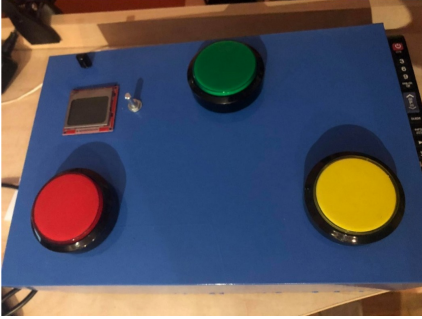	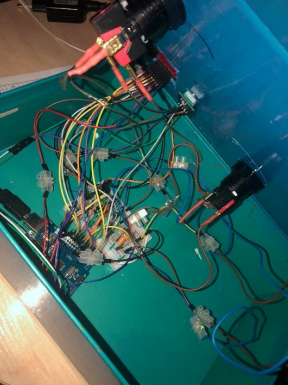

The project is a simple game to test user&#39;s reflex and time of reaction, similar to the classic Whack-a-Mole arcade game. This is the button edition – Whack-a-Button. In a nutshell, the player must strike the buttons as they light up and has a limited time to do so.

The program offers multiple other features, such as measuring the time between the button lightning up and the player striking it and calculating the average reaction time at the end of every game. By means of LCD and a rotary encoder, the player may also navigate through a simple menu, choose their nickname and game level. The speed of the game is dictated by the chosen level. The amount of correct button presses is calculated in real-time and displayed on the screen. Furthermore, a &#39;leader board&#39; (containing three highest scores achieved) is stored in the EEPROM – the user may view it, per wish. If their score beats one of the stored scores, the user is informed.

## 2.2 Playing the game

The game sequence is started only after the system is switched on – the user may do so using the proper on/off button on the remote controller. Using the same button, the system may be switched off any time. Having switched the game on, a short introductory melody is played, and a simple GUI shows up on the screen. The user may navigate through it by means of the rotary encoder rotations and switch presses. Choosing the &#39;LEADERBOARD&#39; option causes some of the contents of the EEPROM chip to be displayed in the Serial Monitor. In order to start playing, the user must choose the &#39;PLAY&#39; option. Then, the username selection menu page appears. The player, again using the functionality of the rotary encoder, chooses their nickname. It may consist of any capital letter from &#39;A&#39; to &#39;Z&#39; and have a maximum of 8 characters length. The user scrolls through the letters and presses the switch in order to select the given one. Then, the position of the letter in the nickname is automatically incremented and the user may choose the next letter. If they do not want to input as many as 8 characters – there is an option to use a long switch press on the last letter to be chosen. Next, the menu queries the user to choose the game level – the range of 1 to 10 is possible. The game level value dictates the speed of the subsequent buttons lightning up and limits the time, in which the user must press the given button in order to continue the game. After selecting the level, the yellow button starts to flash continuously, until the user presses it, which indicates they are ready to play. The game ends whenever the user does not manage to hit a correct button or does not manage to do so in the limited time. The event is also signalled by a game over melody being played. The average reaction time is calculated, and the system checks, whether the high score has been beaten. The user may see all the statistics by means of the output in the serial port. After the finished game, the user has the option of starting the game again – if they chose to do so, the sequence starts again from choosing the game level, the nickname remains the same. If the &#39;NO&#39; option is selected, the username is restored back to default – blank – and the first, main, menu page appears again.

# 3. Peripherals and interface configuration

## 3.1 GPIO

Various general-purpose input and output pins are used in the project to control the peripherals. In case of the digital pins, the general procedure is to first configure the specified pin to behave as INPUT, INPUT\_PULLUP or OUTPUT by means of pinMode() function. The INPUT\_PULLUP mode is used for the rotary encoder&#39;s switch pin in order to enable internal pullup resistors, which are otherwise explicitly disabled with just INPUT. If the pin has been configured as OUTPUT, its voltage is set to either logical state HIGH (5V) or LOW (0V) using the digitalWrite() function. The exact state of the pin may be read back by the digitalRead() method. All these functions are used in our program.
 The configuration of the LED pins is as follows:

```
pinMode(LEDPin, OUTPUT); //set the LED pin as output
```

And to write a HIGH or LOW (turn it on or off) value to it:

```
digitalWrite(LEDPin, LEDState); //update the state of the LED
```

LEDPin is the number of the digital pin to which the LED is connected, whereas LEDState is either HIGH or LOW. The same configuration of pins, using pinMode() function is used for the pins going to the LCD – the RST, CE (CS), DC, Din (MOSI) and CLK pins are all set as outputs. The DC is set (by means of digitalWrite()) HIGH for sending commands and LOW for sending data accordingly. To initialize the display, RST should be written LOW for at least 100ns. During normal operation, it needs to be set HIGH.

As for the rotary encoder, the pin configuration is as follows:

```
pinMode(pinA, INPUT); //set rotary pulses as input
pinMode(pinB, INPUT);
pinMode(pinSW, INPUT_PULLUP); //use the in-built arduino PULLUP
```

PinSW is the pin, to which we connected the switch of the encoder. The pin is configured as INPUT\_PULLUP, as previously mentioned to enable the built-in resistor. Moreover, the switch shorts the line to the ground, when pressed, so it should trigger LOW state detection:

```
uint8_t currentState = digitalRead(pinSW); //read the state of the switch
```

PinA and pinB are the CLK and DT pins, respectively. The rotary encoder&#39;s rotation is read using a GPIO hardware interrupt in LOW mode on the CLK pin, which is configured as follows:

```
attachInterrupt(digitalPinToInterrupt(pinA), encoderIsr, LOW); //attach the isr routine to service the interrupts for encoder
```

The interrupt service routine for the GPIO interrupt, which is called by the encoderIsr routine:

```
#define interruptInterval 5 //interval for isr in ms
void RotaryEncoder::readMovementISR() {
 if (millis() - lastInterruptTime > interruptInterval) { //if interrupts come 
faster than the interval, assume it's a bounce and ignore
 if (digitalRead(pinB) == LOW) { //if B is low (the same as A), we have 
counter-clockwise movement of the encoder
 pulseCnt--;
 }
 else {
 pulseCnt++;
 }
 }
 lastInterruptTime = millis(); // update the interrupt timer - remember the 
last time it was triggered (no more than every 5ms)
}
```

The interrupt makes use of the millis() function, which returns the number of milliseconds passed since the board began running the current program (managed by Timer0). The procedure checks, whether enough time – in this case 5ms – has passed, since the interrupt was last triggered. If so, it checks for the current state of the DT pin – if LOW is read, it means that the rotary encoder is rotated in the counter-clockwise direction, and the internal counter od the encoder is thus decremented. In case of HIGH reading, the counter is incremented to represent the clockwise movement.

As for the buttons, in order to save us some GPIO pins, we designed a voltage divider circuit and connected all three buttons to one analog pin. The ATmega328P used in our board contains an onboard analog to digital converter. The converter has a 10-bit resolution and maps input voltages between 0 and the operating voltage 5V into integer range 0 – 1023. The analog pins also have all the functionality of GPIO pins, so consequently they may be used as ones. Therefore, we could declare the buttons&#39; pin as INPUT, in the same manner as described previously, however, there is no need to do so, since in our program we use analogRead() function in order to determine, whether a given button is pressed. The method in question makes use of the A/D converter and reads the value from the specified analog pin.

## 3.2 I2C

The Inter-integrated Circuit communication bus is used by the EEPROM module, which, as a slave device, has its unique device address to communicate with the master – the UNO board. In the AVR microcontrollers family one may find the counterpart of the I2C bus, which is TWI (Two-Wire Interface). We are using the _Arduino Wire Library_ ([1]) in order to implement it in our program, The communication requires a mere of two wires – one for Serial Clock (clock signal generated by the master device) and one for SDA (the data signal, transferred in sequences of 8 bits – a 7-bit address passed along with a read/write bit). For the communication to happen properly, each line requires a pull-up resistor on it, to restore the signal HIGH when no device is asserting it LOW. The maximum transmission frequency on our board is 400kHz, whereas our serial EEPROM IC, as per datasheet, can communicate at both 100kHz and 400kHz. Therefore, we set the clock frequency for the I2C communication to fast mode – 400kHz, as follows:

```
Wire.begin(); //join the I2C bus as a master
Wire.setClock(400000); //set the clock frequency to 400kHz
```

The begin() function initializes and joins the I2C bus in master mode. The setClock() function calculates the value stored in the TWBR register, responsible for setting the bit rate in the interface, according to the following formula:

```
void TwoWire::setClock(uint32_t clock) {
 twi_setFrequency(clock);
}
void twi_setFrequency(uint32_t frequency) {
 TWBR = ((F_CPU / frequency) - 16) / 2;
 
 /* twi bit rate formula from atmega128 manual pg 204
 SCL Frequency = CPU Clock Frequency / (16 + (2 * TWBR))
 note: TWBR should be 10 or higher for master mode
 It is 72 for a 16mhz Wiring board with 100kHz TWI */
}
```

The bus in our program uses a maximum of 32-byte buffer including two bytes for the address, thus any communication does not exceed this limit.

## 3.3 UART

UART is used to communicate with PC and display messages to the user and implemented by means of built-in _Arduino Serial Library_ ([3]). Baud rate is set to 9600bps:

```
Serial.begin(9600);
```

The UART configuration in the library:

```
// Define config for Serial.begin(baud, config);
#define SERIAL_8N1 0x06
void begin(unsigned long baud) { begin(baud, SERIAL_8N1); }
void HardwareSerial::begin(unsigned long baud, byte config) {
 // Try u2x mode first
 uint16_t baud_setting = (F_CPU / 4 / baud - 1) / 2;
 *_ucsra = 1 << U2X0;
 // assign the baud_setting, a.k.a. ubrr (USART Baud Rate Register)
 *_ubrrh = baud_setting >> 8;
 *_ubrrl = baud_setting;
 _written = false;
 //set the data bits, parity, and stop bits
#if defined(__AVR_ATmega8__)
 config |= 0x80; // select UCSRC register (shared with UBRRH)
#endif
 *_ucsrc = config;
 
 sbi(*_ucsrb, RXEN0);
 sbi(*_ucsrb, TXEN0);
 sbi(*_ucsrb, RXCIE0);
 cbi(*_ucsrb, UDRIE0);
}
```

In order to view the contents of messages, we are utilizing Serial.print() or a mixture of it with Serial.write() in case of EEPROM reading. Both functions take as an argument a series of characters or a number. The difference between the two is that Serial.write() converts numbers in decimal form to ASCII codes. The exemplary message received by the user after finishing the game, viewed in the Serial Monitor:

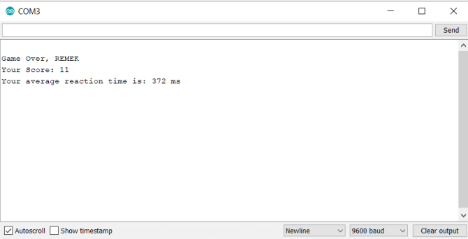

Which is achieved by the following function, called in the main game sequence, after the game is finished:

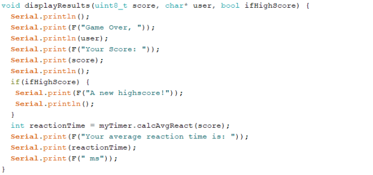

And the output read from the &#39;leader board&#39; stored on the EEPROM. As we can see, the previous user appeared on the list:

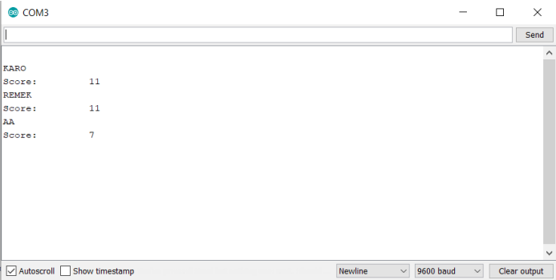

Achieved by reading the EEPROM and printing the results:

```
void Eeprom::readLeaders() {
 Serial.println();
 for (unsigned i = 0; i < highScore3Addr + 5; i++) {
 byte rdata = readChip(i);
 if (i == scoreAddresses[0] || i == scoreAddresses[1] || i == 
scoreAddresses[2]) { //if we are reading from the scores addresses
 Serial.print(rdata); //use print to visualize numbers instead of ASCII 
codes
 Serial.println();
 } else {
 Serial.write(rdata);
 }
 }
}
```

## 3.4 Timer

The timer is responsible for measuring the time between a LED diode lightning up and corresponding button being pressed by the user (that action will switch off the given LED). At the end of the game, the program calculates the average reaction time by dividing the summed up subsequent durations by the number of correct button presses:

```
void ReactionTimer::beginTimer() {
 startTime = millis(); //record the timer start time
}
void ReactionTimer::endTimer() {
 duration += (millis() - startTime); //sum up every durations in order to 
calculate average reaction time in ms
}
int ReactionTimer::calcAvgReact(int correctButtonPresses) {
 int avgReactTime = 0.00;
 if (correctButtonPresses) {
 avgReactTime = (duration / correctButtonPresses); //divide by the amount of 
button presses - current score/amount of correct btn presses
 }
 duration = 0; //reset for the next time playing
 return avgReactTime;
}
```

The beginTimer() and endTimer() are called in the main game sequence every time an LED lights up and a correct button is pressed, respectively.

This functionality, as well as timer-based delays multiply used in our program, exploit the millis() function, controlled by the 8-bit timer0. The method returns number of milliseconds passed since the moment the board began running the current program. The prescaler set for the timer0 is by default 64 and need not to be change. This means that the timer will overflow every 1.024 ms and update millis() as a result.

## 3.5 SPI &amp; LCD Nokia 5110 PCD8544 module

In our project we are using a Nokia 48x84 pixels matrix monochrome LCD with PCD8544 controller. Both the functionalities of LCD and rotary encoder are combined to create a simple user interface for starting to play the game, viewing the contents of the &#39;leader board&#39; stored on the EEPROM, choosing a username and game level.

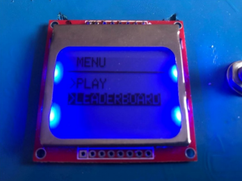
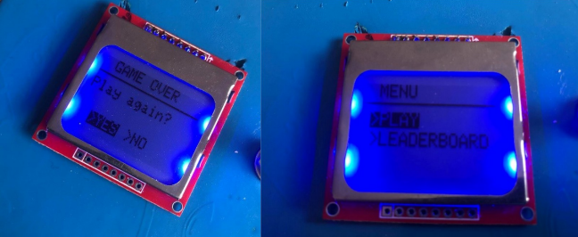
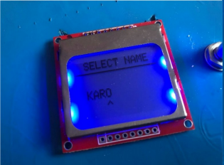
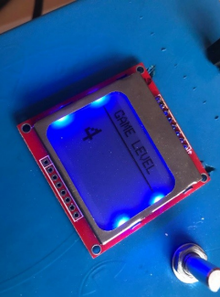

The LCD device communicates using the SPI bus. In order to drive the display we are using the _Adafruit PCD8544 Nokia 5110 LCD Library_ ([4]), which also requires the _Adafruit GFX Graphics_ _Library_ ([5]) in order to function properly, as well as the built-in _Arduino SPI library_ ([6]). According to the datasheet, the device operates in the range of 2.7 – 3.3V and has 3V logic level, so it should be used simultaneously with a logic level shifter or resistors. The PCD8544 driver has a built-in 504 bytes GDDRAM, organized in 6 banks each containing 84 columns with each column able to store 8 bits. Each bit represents a single pixel.

The LCD has 8 pins, 3 of which are used to establish the SPI communication. The CE (Chip Enable) – active low pin, used to select one of many devices sharing the same bus, DIN (MOSI) – serial data pin and CLK – serial clock for the SPI interface. There is also a D/C pin (Data/Command) which as per datasheet has to be pulled HIGH or LOW for either sending commands or sending data, respectively.

On the Arduino it is possible to implement both software (flexible pin options – any digital I/O may be selected) and hardware (faster but must use certain pins and not share them) SPI. In our code we are using hardware SPI, so first we must declare an object for it:

```
Adafruit_PCD8544 disp = Adafruit_PCD8544(5, 4, 3);

/*!
 @brief Constructor for hardware SPI based on hardware controlled SCK (SCLK) and 
MOSI (DIN) pins. CS is still controlled by any IO pin.
 NOTE: MISO and SS will be set as an input and output respectively, so be 
careful sharing those pins!
 @param DC DC pin
 @param CS CS pin
 @param RST RST pin
*/
Adafruit_PCD8544::Adafruit_PCD8544(int8_t DC, int8_t CS, int8_t RST):
 Adafruit_GFX(LCDWIDTH, LCDHEIGHT) {
 // -1 for din and sclk specify using hardware SPI
 _din = -1;
 _sclk = -1;
 _dc = DC;
 _rst = RST;
 _cs = CS;
}
```

DIN and SCLK pins are connected to digital pins 11 and 13 on the Arduino for hardware SPI.

Then, before using the display, one must initialize it:

```
display.begin(); //initialize display
_display.clearDisplay(); //clear the buffer
```

The clearDisplay() function clears the memory buffer, whereas begin() is responsible for initializing the SPI bus and setting the bias, contrast and activating the normal mode. As for the SPI settings they are set in the library as follows:

```
#define PCD8544_SPI_CLOCK_DIV SPI_CLOCK_DIV4 ///< Default to max SPI clock speed 
for PCD8544 of 4 mhz
// Setup hardware SPI.
SPI.begin();
SPI.setClockDivider(PCD8544_SPI_CLOCK_DIV);
SPI.setDataMode(SPI_MODE0);
SPI.setBitOrder(MSBFIRST);
```

The SPI clock is set to the 4MHz speed, mode 0 – CPOL (clock polarity): 0, CPHA (clock phase): 0, Shift and Capture SCK edge: falling and rising respectively. To transfer data, the SPI.transfer(uint8\_t) function is used:

```
// Write to the SPI bus (MOSI pin) and also receive (MISO pin)
inline static uint8_t transfer(uint8_t data) {
 SPDR = data;
 /*
 * The following NOP introduces a small delay that can prevent the wait
 * loop form iterating when running at the maximum speed. This gives
 * about 10% more speed, even if it seems counter-intuitive. At lower
 * speeds it is unnoticed.
 */
 asm volatile("nop");
 while (!(SPSR & _BV(SPIF))) ; // wait
 return SPDR;
}
```

In our menu code we are using the basic functions defined in the Adafruit library, such as: setTextSixe() to set the font size, setCursor(X, Y) to the specified position on the display, print(&quot; &quot;) or println(&quot; &quot;) to display text on the screen, and most importantly the display() function which is necessary get the visual effects of the pixels showing up on the screen -without the call to that function, the bulk transfer from the screen buffer (stored in the microcontroller) to the internal memory of the PCD8544 controller will not be performed.

The functions, which must be called in the main loop, used to display the menu and switch between the pages are defined as follows:

```
void Lcd::drawMenu() {
 encoder.checkSwPresses(); //check for encoder's switch input
 encoder.updateCounter(); //update encoder's position
 displayEncVal(); //interpret encoder's rotation
 switchPage(); //switch page in case of a press
 switch (page) {
 case OFF:
 _display.clearDisplay(); //for turning off the game
 break;
 case MENU:
 displayMainMenuPage(); //main menu
 break;
 case SELECT_USER:
 displayUserNamePage(); //select username
 break;
 case GAME_LEVEL:
 displayLevelPage(gameLevel); //select level
 break;
 case GAME_OVER:
 displayGameOverPage(); //prompt the user to decide: do they want to play 
again?
 break;
 }
 _display.display(); //display the pixels on the LCD
}

void Lcd::switchPage() {
 if (encoder.isSwPressed()) { //if we press the rotary switch
 encoder.setPulseCnt(0); //reset the encoder's counter
 while (encoder.isSwPressed()) { //wait for the release of the switch
 encoder.checkSwPresses();
 }
 switch (page) {
 case MENU:
 if (currentMenuItem == 1) { //PLAY
 page = SELECT_USER;
 } else if (currentMenuItem == 2) { //LEADERBOARD
 eeprom.readLeaders(); //view it in the Serial port
 }
 break;
 case SELECT_USER:
 currentLetter++;
 pos += 6;
 if (currentLetter > 7 || encoder.getLongPress()) {
 page = GAME_LEVEL;
 currentLetter = 0; //reset back to default for the next time
 pos = 10;
 }
 break;
 case GAME_LEVEL:
 levelFlag = true;
 page = UNKNOWN;
 _display.clearDisplay();
 break;
 case GAME_OVER:
 if (currentMenuItem == 1) { //YES
 page = GAME_LEVEL;
 } else if (currentMenuItem == 2) { //NO
 for (int i = 0; i < 8; i++) { //reset the name
 userName[i] = 32;
 }
 page = MENU;
 }
 break;
 }
 }
}
```

We have several pages in the menu, some of them having two possibilities to choose from, thus in order to choose one of them the following line of code is used:

```
if (page == MENU || page == GAME_OVER) {
 //we have 2 items on the page
 currentMenuItem = abs(encVal % 2) + 1; //highlight the current position of the encoder
```

Since there are 2 items on the page, regardless of the encoder&#39;s internal counter, the even values represent the 2nd item, uneven – the first. We are using the abs() function, since if one were to rotate the encoder only in the contraclockwise direction – the values stored in the counter would be negative, and adding one, since the counter starts from zero every time. As per choosing the username, or the game level, the values of the counter are utilized and looped constantly either displaying capital letters or values from 1 – 10, respectively. The &#39;looping&#39; is achieved as follows:

```
else if (page == SELECT_USER) {
 userName[currentLetter] = encVal + 65; //start from 'A'
 restrictUserName(encVal);
}
void Lcd::restrictUserName(int encVal) {
 //in the counter we start from zero, but the letter was set to 'A', so
 if (encVal > 25) { //if we (rotating clockwise) get to the counter value 
bigger than ASCII code 'Z'
 userName[currentLetter] = 90; //set the letter as 'Z"
 encoder.setPulseCnt(0); //reset the encoder's counter
 } else if (encVal < 0) { //if we rotate counterclockwise
 userName[currentLetter] = encVal + 91; //encVal is negative, so add ASCII 
code 'Z" + 1 =
 // (-1 + 91 = 90 = 'Z', -2 + 91 = 89 = 
'Y' etc.
 if (userName[currentLetter] < 65) { //if we get 'lower' than 'A'
 userName[currentLetter] = 65; //loop again
 encoder.setPulseCnt(0);
 }
 }
}
```

Selecting the game level is handled in a similar manner, only displaying numbers. The menu pages are switched by means of encoder presses, a long press may be used, while selecting the username in order to input less than 8 characters.

## 3.6 IR receiver

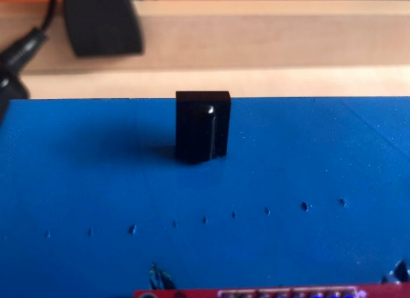

In order to switch the game on/off we are using infrared communication – by means of a TSOP31236 infrared receiver module (works at 36kHz), the _IRremote Arduino Library_ ([7])andany type of a remote controller it is possible to control the peripheral devices. First, we have to initialize an object of the library, specifying the pin, to which the receiver is connected (in our program an analog one, due to the lack of digital pins):

```
IRrecv ir_receiver(A0); //pin of the receiver
RemoteController controller(ir_receiver);
```

And inside our class initialize a reference to that object:

```
RemoteController::RemoteController(IRrecv &irrecv) : _irrecv(irrecv) {};  //initialize the reference to IRremote object
```

The receiving works by obtaining codes from the remote controller (the decode() method) – if a non-zero value is received, it initializes an instance of the decode\_results structure. Once a code has been decoded successfully, the resume() method must be called, in order to continue receiving values. The library uses the 8-bit timer2 – an interrupt service routine is called every 50 microseconds (prescaler 8) performs measurements and stores them in a buffer, which then is interpreted into a code value by the decode() function. In the main game sequence, in order to implement this functionality, the following function is called:

```
#define intervalCheck 800 //the interval required for moving the finger 
away from the 'on/off' button 
bool RemoteController::receive() { //must run in the main loop
 if (_irrecv.decode(&results))
 {
 long receivedVal = 0;
 if (millis() - previousMillisCheck >= intervalCheck) { //check if the time required to move the finger away from the button has passed
 previousMillisCheck = millis();
 receivedVal = results.value; //read the remote controller value
 //Serial.println(receivedVal, HEX);
 }
 _irrecv.resume(); //resume receiving the values
 return isIRCorrect(receivedVal);
 }
 return false;
}
```

The method obtains the decoded value and checks, whether the code from the remote controller matches the predefined value of the button on our remote controller – which was obtained by means of the same procedure, printed in the Serial Monitor and defined in our code:
```
#define remoteCode 0xE0E040BF //the hexadecimal value of the on/off button on our controller; read from the serial monitor 
//- must be corrected if different remote controller is used
```

Thus, the call to isIRCorrect(), determines if the correct button on the remote was pressed, and decoded appropriately:

```
bool isIRCorrect(long receivedIR) { //check if the received value matches the remote controller code
 return (receivedIR == remoteCode);
}
```

The receive() function also makes use of the timer-based delays between the subsequent calls to it, in order to give the user time to take their finger of the button – otherwise the function may be called even multiple times, even if the button was pressed only once. In the main game sequence there is a Boolean flag called &#39;systemInitialized&#39;, initially set to false. By means of the receive() function, we may switch the game on and off – although it is not really switching, since the source of power is not cut by any means. However, without using the remote controller, playing the game would not be possible, and as for switching it off – the display is cleared, LEDs are being turned off, global variables are reset and using any of the devices would be to no avail in this state.

## 3.7 PWM timer &amp; Buzzer

In our program we are using a buzzer and taking advantage of the MCU capability to produce PWM signals in order to play music. We have plugged the buzzer to the digital pins number 9 and 10, which are controlled by timer1 and support the functionality of writing a PWM signal to them.

There are two different melodies played in our project – one at the beginning, after switching the game on, and one once the user has finished the game. The melodies are defined as arrays, containing set of different pitches – frequencies – and durations – quarter notes, eighteenth, etc, determining how long a given pitch should be played:

```
#define NOTE_D4 294
#define NOTE_E4 330
#define NOTE_G4 392
#define NOTE_GS4 415
#define NOTE_A4 440
#define NOTE_AS4 466
#define NOTE_B4 494
#define NOTE_C5 523
#define NOTE_E5 659
#define NOTE_G5 784
#define REST 0
// notes of the melody followed by the duration.
// a 4 means a quarter note, 8 an eighteenth, etc
// negative numbers are used to represent dotted notes,
// so -4 means a dotted quarter note, that is, a quarter plus an eighteenth!!
int melodyInit[] = {
 NOTE_E5, 8, NOTE_E5, 8, REST, 8, NOTE_E5, 8, REST, 8, NOTE_C5, 8, NOTE_E5, 8,
 NOTE_G5, 4, REST, 4, NOTE_G4, 8, REST, 4, REST, 4
};
int melodyGameOver[] = {
 NOTE_C5, -4, NOTE_G4, -4, NOTE_E4, 4,
 NOTE_A4, -8, NOTE_B4, -8, NOTE_A4, -8, NOTE_GS4, -8, NOTE_AS4, -8, NOTE_GS4, -8,
 NOTE_G4, 8, NOTE_D4, 8, NOTE_E4, -2
};
```

We may choose the melody by calling the following function:

```
void Buzzer::playMelody(uint8_t whichMelody) {
 int *melody;
 switch (whichMelody) {
 case 1:
 melody = melodyInit;
 break;
 case 2:
 melody = melodyGameOver;
 break;
 }
 play(melody);
}
```

Which takes as an argument a number of melody: 1 or 2, and then calls the play() method, defined as follows:

```
void Buzzer::play(int melody[]) {
 uint8_t noteCounter = 0;
 int noteDuration = 0;
 unsigned long previousMillisPlaying = 0;
 do {
 if (millis() - previousMillisPlaying > (noteDuration + 0.1 * noteDuration)) {
 previousMillisPlaying = millis();
 int divider = melody[noteCounter + 1];
 if (divider > 0) {
 // regular note, just proceed
 noteDuration = (wholeNote) / divider;
 } else if (divider < 0) {
 noteDuration = (wholeNote) / abs(divider); //dotted notes are represented 
with negative durations
 noteDuration *= 1.5; // increases the duration in half for dotted notes
 }
 toneAC(melody[noteCounter], 10, noteDuration * 0.9); //play the note for 90% 
of the duration
 noteCounter += 2;
 }
 } while (noteCounter < melodyLength * 2);
}
```

Where both melodies have the same length (array size) and tempo – used to make the song slower or faster:

```
#define tempo 200 //change those to make the song slower or faster
#define melodyLength 12
```

And the wholeNote variable, responsible for calculating the duration of a whole note:

```
//this calculates the duration of a whole note in ms
const int wholeNote = (60000 * 4) / tempo;
```

The play() function first of all uses a timer-based delay in order to check whether enough time has passed to play another note, and if yes - updates the last time a note started to be played – this is stored in the previousMillisPlaying variable. Since we have different durations for each note – quarters, eighteenth, etc. – the divider variable gets the duration for the given note from the array and, if the duration is negative, the given note duration is increased. The noteCounter variable is incremented every time by two, since the actual pitches are stored in the melody&#39;s array only on even indices. The most important, responsible for producing audible sound, is the call to the toneAC() function, defined in the _ToneAC Library_ ([8]). It takes a specified frequency (in Hz), volume (range 0-10) and length to play in milliseconds as arguments. The duty cycle – the value in the Output Compare Registers - is set depending on the volume and its corresponding value from an array in a following way:
```
uint8_t _tAC_volume[] = { 200, 100, 67, 50, 40, 33, 29, 22, 11, 2 }; // Duty for 
linear volume control.
OCR1A = OCR1B = top / _tAC_volume[volume - 1]; // Calculate & set the duty cycle (volume).
```

Thus, the top value is always divided by 2 in our case. The most important to note, is the call to the following function inside toneAC():

```
void toneAC_playNote(unsigned long frequency, uint8_t volume) {
 PWMT1DREG |= _BV(PWMT1AMASK) | _BV(PWMT1BMASK); // Set timer 1 PWM pins to 
OUTPUT (because analogWrite does it too).
 uint8_t prescaler = _BV(CS10); // Try using prescaler 1 first.
 unsigned long top = F_CPU / frequency / 2 - 1; // Calculate the top.
 if (top > 65535) { // If not in the range for 
prescaler 1, use prescaler 256 (122 Hz and lower @ 16 MHz).
 prescaler = _BV(CS12); // Set the 256 prescaler bit.
 top = top / 256 - 1; // Calculate the top using 
prescaler 256.
 }
 ICR1 = top; // Set the top.
 if (TCNT1 > top) TCNT1 = top; // Counter over the top, put 
within range.
 TCCR1B = _BV(WGM13) | prescaler; // Set PWM, phase and 
frequency corrected (top=ICR1) and prescaler.
 OCR1A = OCR1B = top / _tAC_volume[volume - 1]; // Calculate & set the duty 
cycle (volume).
 TCCR1A = _BV(COM1A1) | _BV(COM1B1) | _BV(COM1B0); // Inverted/non-inverted mode 
(AC).
}
```

Therefore, the buzzer pins are set to OUTPUT, and depending on the frequency value, the top is calculated and the prescaler is set – either to 1 or 256 for lower frequencies. Then the top is divided, as previously mentioned, by 2. F\_CPU symbolizes the processor clock frequency, which on our board is equal 16 MHz. The PWM is set to Phase-correct mode (the timer goes up and down).

## 3.8 LED Arcade Buttons

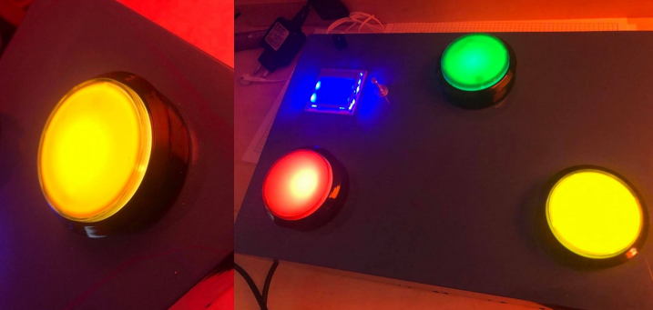

As the name suggests, out buttons are comprised of two parts – a button itself and a LED inside. Thus, one button in fact requires 2 pins from the UNO board – one for the button, and one for the LED. For the sake of saving us some of the digital pins, we have created a voltage divider circuit (one 1K Ohm resistor and 3 10K resistors) in order to connect the buttons to just one analog pin. This comes with a restriction – there have to be already defined voltage values of each button mapped into integer range and obtained by means of the analogRead() function. Thus, we first used Serial Monitor and the following method, to read the value of each button:

```
void ArcadeButtons::readBtnValue() { //for reading the analog value of a 
button; must be put in the main loop
 Serial.println(analogRead(btnsPin)); //print the value of a pressed button
}
```

And created an array containing those values:

```
const int btnsValues[btnsNum] = {895, 395, 205}; //analog value of the button 
//(range 0-1023), read by means of serial monitor and analogRead function; must be 
//changed if different values are detected
```

The array will serve as an indicator of the fact, whether a given button is pressed. Determining that is achieved in the following function:

```
#define TOL 20 //we need some kind of a tolerance, when reading a given 
button value, since sometimes the signal flickers
bool ArcadeButtons::getBtnState(uint8_t atIndex) {
 return ((analogRead(btnsPin) <= (btnsValues[atIndex] + TOL)) && 
(analogRead(btnsPin) >= (btnsValues[atIndex] - TOL))); //buttons pin is connected 
to ground (through the pull-down resistor)
}
```

The function compares the value obtained from reading the voltage level on the buttons&#39; pin with the value stored in the previously mentioned array – if the value is in the proper range (which is needed since sometimes the signal flickers and cannot be read as exactly equal to the one in the array), it means the given button is pressed. We utilize the above function, while debouncing and checking the buttons&#39; input:

```
#define debounceTime 10 //debounce time in milliseconds 
void ArcadeButtons::checkBtnsStates() { //check for button changes
 uint8_t currentBtnState; //declared static to prevent redefinitions
 //debounce
 if ((lastDebounceTime + debounceTime) > millis()) {
 return; //not enough time has passed to debounce, so wait longer
 }
 //we have waited DEBOUNCE milliseconds, so reset the timer
 lastDebounceTime = millis();
 //
 for (int i = 0; i < btnsNum; i++) {
 currentBtnState = getBtnState(i); //read the button
 if (currentBtnState != btnState[i]) { //if the previous button state has 
changed
 btnState[i] = currentBtnState; //set it as the current value
 }
 }
}
```

Where the last button state (stored in the btnState array) is compared to the current button state (returned by the getBtnState() function) and if that state has changed, the array is updated. The function also makes use of the timer-based delay for debouncing – if the calls come faster than 10 milliseconds, they are assumed as bounce and ignored.

As for the LEDs, in our program we may set them to flash: a specified number of times:

```
void BtnFlasher::startFlasher(uint8_t flashNumberOfTimes) { //flash the LED a 
given number of times
 flashCounter = flashNumberOfTimes * 2; //we want to have a full flash - turn on 
and turn off
 flashForever = 0;
 LEDState = LOW;
 digitalWrite(LEDPin, LEDState); //write LOW to the LED pin
}
```

or indefinitely:

```
void BtnFlasher::setFlashForever(uint8_t oneOrZero) {
 flashForever = oneOrZero; //if 1 - start flashing continuously, if 0 - stop the 
LED already flashing
 if (!oneOrZero) {
 startFlasher(0);
 }
}
```

The startFlasher() function accepts as an argument a number representing the number of times we want to flash a given LED – the argument is multiplied by 2 inside the function, since we understand a one flash as a &#39;full&#39; one – the LED has to be turned on, and then off. In case of flashing the LED indefinite number of times we have to utilize the setFlashForever() method, which accepts as argument number 1, or 0. If 1 is passed, the LED is flashed continuously – we may stop that process calling the function again with 0 as an argument.

However, it is important to note that none of those two functions would work properly, if we did not define the following one:

```
#define ledBlinkInterval 750 //interval for blinking the LED - time between on 
and off
void BtnFlasher::updateFlasher() {
 //check to see if it's time to change the state of the LED
 if ((millis() - previousLEDMillis >= ledBlinkInterval) && ((flashCounter > 0) || 
(flashForever == 1))) {
 previousLEDMillis = millis(); //remember the time.
 LEDState = !LEDState;
 digitalWrite(LEDPin, LEDState); //update the state of the LED
 if (flashCounter > 0) {
 flashCounter--; //update the flash counter
 }
 }
}
```

This function is responsible for updating the LED state – if it is currently HIGH, changes it to LOW and vice versa. If the number of flashes was specified, it updates the internal counter as well. It also makes use of the timer-based delay, which checks, whether 750 milliseconds have passed, since the last time we updated the LED state. We have also defined a function, to set the state of a randomly chosen LED in the main game sequence – light it up or turn it off again:

```
void setFlasherState(uint8_t state) { //light up or turn off the LED
 LEDState = state;
 digitalWrite(LEDPin, LEDState);
}
```

Both checkBtnsStates() and updateFlasher() functions must be called in the main loop(), for the program to work properly.

## 3.9 Rotary encoder

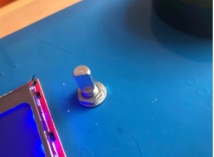

The rotary encoder we are using is an incremental one, which means that it generates an electrical signal according to the rotation movement and its output is a series of square waves pulses. The encoder has two outputs – A and B, which are 90 degrees out of phase with respect to each other. When the disk is rotated, the pins will contact the common pin and generate those wave outputs. Using this knowledge, one may determine both the rotation position and the direction. If we are rotating the knob clockwise – output A will be ahead of B, so at the time when signal changes, A and B will have opposite values. Conversely, if we are rotating the knob in a counterclockwise manner, the values will be equal. We are utilizing those facts in the ISR routine (described in section 3.1). Our encoder has an internal pulse counter which we are incrementing – or decrementing – accordingly:

```
void RotaryEncoder::readMovementISR() {
 if (millis() - lastInterruptTime > interruptInterval) { //if interrupts come 
faster than the interval, assume it's a bounce and ignore
 if (digitalRead(pinB) == LOW) { //if B is low (the same as A), we have 
counter-clockwise movement of the encoder
 pulseCnt--;
 }
 else {
 pulseCnt++;
 }
 }
 lastInterruptTime = millis(); // update the interrupt timer - remember the 
last time it was triggered (no more than every 5ms)
}
```

We update this value by means of the following function, which must be run in the main loop:
```
void RotaryEncoder::updateCounter() { //must be run in the loop
 if (pulseCnt != lastCnt) { //if the current rotary switch position has 
changed then update everything
 lastCnt = pulseCnt; //remember the new value
 }
}
```

The device also has a switch, which we are using in two ways – differentiating between short and long presses of it. This is handled as follows (again must be run in the main loop):

```
#define debounceDelay 50 //the debounce time
void RotaryEncoder::checkSwPresses() { //must be run in the main loop
 uint8_t currentState = digitalRead(pinSW); //read the state of the switch
 //If the switch changed, due to noise or pressing:
 if (currentState != lastSwState) {
 lastDebounceTime = millis(); //reset the debouncing timer
 }
 if ((millis() - lastDebounceTime) > debounceDelay) { //we have waited longer 
than the required debounce delay
 // if the button state has changed:
 if (currentState != swState) {
 swState = currentState; //update it
 if (!swState) { //LOW means pressed
 swTimer = millis(); //to detect a long press
 }
 }
 }
 // save the reading. Next time through the loop, it'll be the lastSwState:
 lastSwState = currentState;
}
```

We are debouncing the switch of the encoder in a very similar manner to the one used in case of the buttons. If the last switch state has changed, either because of pressing or some noise, we update the variable storing the last time such change has been detected. This is double checked in the second if conditional statement – if such changes come faster than 50 ms (debounceDelay) we just ignore them, since the probability of someone pressing the knob faster than 50 ms is very small. Otherwise, the switch state is updated – set to LOW if pressed – and the time of pressing is recorded, for detecting a long press. Those presses are determined in the following way:

```
#define longPressTimer 300 //detect long presses
bool getLongPress() {
 if ((millis() - swTimer >= longPressTimer) && swState) {
 return true;
 }
 return false;
}
```

The function simply checks, whether one had pressed, held down the switch for longer than at least 300 ms, and finally released it – if so, a long press is detected.

## 3.10 24LC256 Serial EEPROM module

The UNO board, the master, is programmed to both write data to and request (then read) 1 byte of data at a time, sent form the uniquely addressed EEPROM chip (the slave). The received messages may be viewed in the serial monitor window.

The 24LC256 is a 256k EEPROM, which means it has 32kB of storage space available. The device has three address pins to select the I2C address labaled from A2 to A0. In our program, they are all connected to ground, which, according to the chip&#39;s datasheet, indicates a hexadecimal address of 0x50. That address is defined in our program for ease of access:

```
#define chipAddress 0x50 //the addres of the memory chip is determined by the A2, A1, A0 pins (datasheet)
```

The device, since it communicates using the I2C bus, has also SDA and SCL pins, which are connected to the board (via the pull-up resistors) to the 18-th and 19-th pins, respectively.

In order to create the &#39;leader board&#39; for the game, we initially wrote some data to the device. The basic operations of reading and writing are performed on the EEPROM by means of three functions, since we distinguished writing strings and numbers to the EEPROM, in order to handle a potential boundary-crossing issue. The device&#39;s storage is split into pages that are 64 bytes wide. If the page boundary is crossed and that is not handled properly, some of the data may be overwritten and lost. Therefore, in case of writing strings, the program calculates how much remaining space there is in the starting page, and if necessary, breaks up the data to make the writing fit into the page boundaries:

```
// Calculate length of data
do {
 dataLen++;
} while (data[dataLen]);
// Calculate space available in first page
pageSpace = int(((eeAddress / BYTES_PER_PAGE) + 1) * BYTES_PER_PAGE) - eeAddress;
// Calculate first write size
if (pageSpace > MAX_WRITE) {
 firstWriteSize = pageSpace - ((pageSpace / MAX_WRITE) * MAX_WRITE);
 if (firstWriteSize == 0) firstWriteSize = MAX_WRITE;
}
else
 firstWriteSize = pageSpace;
// calculate size of last write
if (dataLen > firstWriteSize)
 lastWriteSize = (dataLen - firstWriteSize) % MAX_WRITE;
// Calculate how many writes we need
if (dataLen > firstWriteSize)
 numWrites = ((dataLen - firstWriteSize) / MAX_WRITE) + 2;
else
 numWrites = 1;
for (page = 0; page < numWrites; page++) {
 if (page == 0) writeSize = firstWriteSize;
 else if (page == (numWrites - 1)) writeSize = lastWriteSize;
 else writeSize = MAX_WRITE;
}
```

Where BYTES\_PER\_PAGE equals 64 and MAX\_WRITE equals 16, due to the fact that the Arduino uses a 32 byte buffer, which also needs to include the memory locations bytes, which reduces the available space to 30 bytes. Thus, we pick 16 as a divisor of 64. The actual writing process of a longer string is defined as follows:

```
for (page = 0; page < numWrites; page++) {
 if (page == 0) writeSize = firstWriteSize;
 else if (page == (numWrites - 1)) writeSize = lastWriteSize;
 else writeSize = MAX_WRITE;
 initChip(eeAddress);
 counter = 0;
 do {
 Wire.write((byte) data[i]);
 i++;
 counter++;
 } while ((data[i]) && (counter < writeSize));
 Wire.endTransmission();
 eeAddress += writeSize; // Increment address for next write
 delay(6); // needs 5ms for page write
}
```

For numbers, the process is similar, however does not involve any loops since numbers (game scores) written by our program are stored using one byte only:

```
initChip(eeAddress);
Wire.write(data);
Wire.endTransmission();
delay(5); //needs a small delay for writing
```

The contents of the EEPROM may be viewed by means of readChip() function, which takes as an argument the address we wish to read from and if the operation is successful – returns first requested 1 byte from the specified address on the chip:

```
void Eeprom::initChip(unsigned int eeAddress) {
 Wire.beginTransmission(chipAddress);
 Wire.write((int)(eeAddress >> 8)); //MSB
 Wire.write((int)(eeAddress & 0xFF)); //LSB
}
uint8_t Eeprom::readChip(unsigned int eeAddress) {
 uint8_t rdata = 0xFF;
 initChip(eeAddress);
 Wire.endTransmission(); //end transmission
 Wire.requestFrom(chipAddress, 1); //request one byte from the slave device
 if (Wire.available()) { //slave may not send anything at all
 rdata = Wire.read(); //receive the byte
 }
 return rdata;
}
```

Every operation on the device, regardless whether it is read or write, requires the initChip() function. We first call the Wire.beginTransmission() function, by means of which we may begin the transmission to the I2C device with a uniquely specified address – 0x50 in ours case. Next, the address on the EEPROM we want to write to or read from must be sent. The initChip() method takes that address as an argument – since the range of available addresses is 0 – 32,767, we are using exactly 16 bits to store it but we can only send 8 bits at the time. Thus, the first write() function, which may be called only in-between calls to beginTransmission() and endTransmission(), takes the address and shifts the bits to the right by eight, which causes the Most Significant Bits to be sent. Next, we do a bitwise AND to get the last eight nits of the address. Finally, we end the transmission to the slave device in the subsequent functions of reading and writing.

As for the read function itself, after setting the address on the EEPROM to the one we are interested in, a call to requestFrom() sends the command to that chip to start sending the data at the address we set above. The second argument is how many bytes (starting at this address) to send back; we&#39;re only requesting one.

Therefore, utilizing those functions we first created a form for our leaderboard, using the following function:

```
void Eeprom::initWrite() {
 unsigned int address = 0; //start at address zero
 char usernamePlace[10] = {'\n', 32, 32, 32, 32, 32, 32, 32, 32}; //write blank 
space for username
 char* writeOut[2] = {usernamePlace, "\nScore: "}; //add another string in the 
new line for the score
 for (int i = 0; i < leadersNum; i++) {
 leadersAddresses[i] = address; //store the address of the first byte in the 
username
 for (int k = 0; k < 2; k++) {
 writeStringToChip(address, writeOut[k]);
 }
 scoreAddresses[i] = address; //store the address of score
 writeNumberToChip(address, 0); //write initially 0 - will be overwritten
 address += 1;
 }
 ```

The purpose of this was to determine both addresses of a first character in the username, and scores addresses, and define them as constants in our program, in order to be able to overwrite those, in case the given score is high enough to be on the &#39;leaderboard&#39;. Having defined those addresses we may now use the following method in order to overwrite according data on the chip:

```
void Eeprom::initWrite() {
 unsigned int address = 0; //start at address zero
 char usernamePlace[10] = {'\n', 32, 32, 32, 32, 32, 32, 32, 32}; //write blank 
space for username
 char* writeOut[2] = {usernamePlace, "\nScore: "}; //add another string in the 
new line for the score
 for (int i = 0; i < leadersNum; i++) {
 leadersAddresses[i] = address; //store the address of the first byte in the 
username
 for (int k = 0; k < 2; k++) {
 writeStringToChip(address, writeOut[k]);
 }
 scoreAddresses[i] = address; //store the address of score
 writeNumberToChip(address, 0); //write initially 0 - will be overwritten
 address += 1;
 }
```

# 4. Failure Mode and Effect Analysis

Our realized project depends, to a greater or lesser extent, on the operation of the used devices. Some of them are just an optional addition to the project and in case of their damage, they would not affect the overall usefulness of the game. However, there are devices that are critical to proper program operation and execution, and their failure would make the project useless. Below table presents the devices and their functionality taken into account in this failure mode analysis, with right column defining the gravity of the given item&#39;s failure.

| **Item/function** | **Severity** |
| --- | --- |
| Microcontroller | Critical |
| Power supply | Critical |
| LED arcade buttons | Critical |
| IR receiver | Negligible |
| LCD | Medium |
| Rotary Encoder | Critical |
| EEPROM | Negligible |
| Timer | Medium |
| Buzzer | Negligible |

The project heavily depends on the microcontroller, power supply and buttons. With no source of power or the microcontroller, no functionality will be executed. The buttons are also critical, since their failure would make the game useless. The power supply must be also present since the project has no backup or battery power source.

We opted for the LCD module, as well the timer, for being of medium importance. The LCD module along with rotary encoder serve as our user GUI, without it the interaction with the game would be much more complicated. However, the LCD may be replaced, for instance, by displaying messages in the Serial Monitor by means of the UART interface. Rotary encoder would be still necessary, for example to choose the game level, thus it is crucial for our program operation. As for the timer, it does not affect the program execution. Nevertheless, without it working properly, the user would not be able to be informed about their average reaction time, which is one of the points of the game.

As for the rest of the items, their severity is negligible, due to the fact that they provide some additional features such as playing short melodies or switching the game on and off with a remote controller, which may be easily replaced by a regular push button.

When it comes to detecting the system failure, it would be easy to spot the power supply malfunction, while observing the backlight of the LCD or LEDs built in the buttons – when they light up at improper times or do not light up at all. Such a situation may indicate problems with jumper wires or power supply cable. Furthermore, power-related issues may result from causing a short in a circuit, either by connecting power rail to the ground or placing a wire in the incorrect pin.

A microcontroller failure would be also easy to detect, as it would be most likely a complete malfunction of the whole chip, resulting in problems with uploading the code, or executing it.

As for the buttons, the problems may arise, when there is some kind of misconnection between the buttons and its pins, caused most likely by the jumper wire, as using the analogRead() function on it, would yield improper results. This could be spotted by the program not responding to buttons&#39; presses. The jumper wires connections could also be at fault in the case of rotary encoder.

# 5. References

[1] Wire. Retrieved, from [https://www.arduino.cc/en/reference/wire](https://www.arduino.cc/en/reference/wire)
[2] [https://serwis.avt.pl/files/kurs\_c/35\_KursAVR\_cz14.pdf](https://serwis.avt.pl/files/kurs_c/35_KursAVR_cz14.pdf)
[3] Serial. Retrieved from [https://www.arduino.cc/reference/en/language/functions/communication/serial/](https://www.arduino.cc/reference/en/language/functions/communication/serial/)
[4] Adafruit. (2019, October 8). adafruit/Adafruit-PCD8544-Nokia-5110-LCD-library. Retrieved from [https://github.com/adafruit/Adafruit-PCD8544-Nokia-5110-LCD-library](https://github.com/adafruit/Adafruit-PCD8544-Nokia-5110-LCD-library)
[5] Adafruit. (2020, May 18). adafruit/Adafruit-GFX-Library. Retrieved from [https://github.com/adafruit/Adafruit-GFX-Library](https://github.com/adafruit/Adafruit-GFX-Library)
[6] SPI. Retrieved from [https://www.arduino.cc/en/reference/SPI](https://www.arduino.cc/en/reference/SPI)
[7] A Multi-Protocol Infrared Remote Library for the Arduino. Retrieved from [http://www.righto.com/2009/08/multi-protocol-infrared-remote-library.html](http://www.righto.com/2009/08/multi-protocol-infrared-remote-library.html)
Open source: [https://github.com/z3t0/Arduino-IRremote](https://github.com/z3t0/Arduino-IRremote)
[8] Retrieved from [https://bitbucket.org/teckel12/arduino-toneac/wiki/Home](https://bitbucket.org/teckel12/arduino-toneac/wiki/Home)
[9] Board. Retrieved from [https://www.arduino.cc/en/reference/board](https://www.arduino.cc/en/reference/board)
[10] Last Minute Engineers. (2019, December 13). In-Depth: How Rotary Encoder Works and Interface It with Arduino. Retrieved from [https://lastminuteengineers.com/rotary-encoder-arduino-tutorial/](https://lastminuteengineers.com/rotary-encoder-arduino-tutorial/)
[11] SecretsOfArduinoPWM. Retrieved from [https://www.arduino.cc/en/Tutorial/SecretsOfArduinoPWM](https://www.arduino.cc/en/Tutorial/SecretsOfArduinoPWM)
[12] Retrieved from [https://learn.sparkfun.com/tutorials/i2c](https://learn.sparkfun.com/tutorials/i2c)

# 6. Other information

The project uses one board and one program. We did not discuss the main game sequence in such detail, since it mainly comprises of, and combines, the functionalities of our peripheral devices. The loop function mainly updates the peripherals&#39; states and checks for the remote controller input:

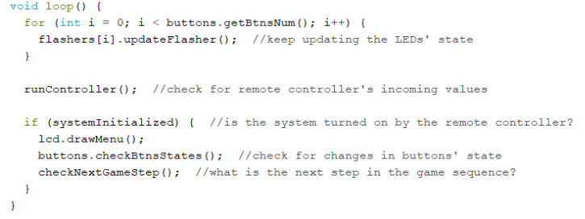

Only the checkNextGameStep() function switches the state of the game depending on user interaction:

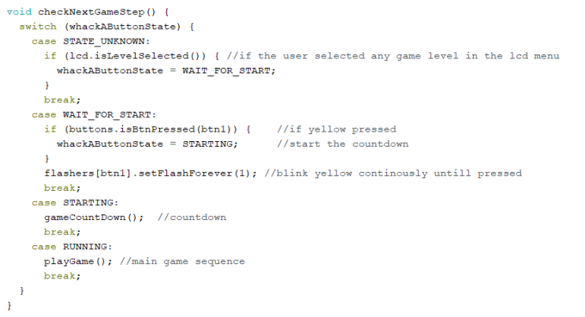

The main game sequence is contained in the playGame() function, which is responsible for turning random lights on and off – if the correct button was pressed, checking whether a correct button was pressed, and if it was performed in the required time, as well as activating and disactivating the timer for measuring the reaction time and incrementing the score counter, if necessary. The randomness is achieved by initializing the pseudo-random number generator initializing it with a random input from the analogRead on an unconnected pin:

```
randomSeed(analogRead(0)); //for using random, initialized with a random input on an unconnected pin
```

Below we present the schedule for the Midterm Checkpoint and Final evaluation:

MTC: remote controller (with IR receiver), LED arcade buttons, rotary encoder (for the game menu, choosing the username).

For the MTC, we also planned to implement the LCD, communicating by means of the SPI bus, displaying the game menu, however due to the several malfunctions of the device, delayed and difficult contact with the producer, we did not manage to replace it in time for the MTC deadline and thus, we did not present it then.

Final evaluation:

- Play PWM controlled melody with a buzzer,
- Implement timer to measure the user reaction time,
- Implement UART to communicate with the PC and display messages,
- Store and retrieve data using EEPROM and I2C bus.
